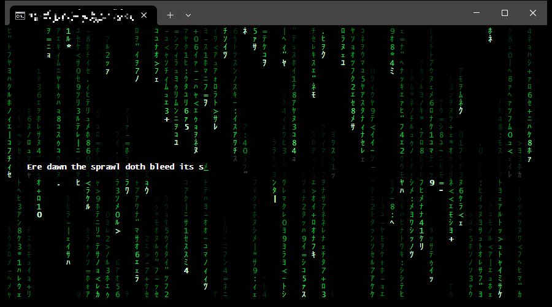

# cmatrix-rs



Matrix digital rain for Windows Terminal. No dependencies.

Inspired by [cmatrix](https://github.com/astyfoo/cmatrix) by Chris Allegretta, Abishek V Ashok and Xylia Allegretta. This is a separate Rust implementation; it contains no cmatrix code or data.

## Build

```sh
cargo build --release   # produces cmatrix.exe
cargo test
```

Releases are built by GitHub Actions from version tags; see [docs/RELEASING.md](docs/RELEASING.md).

## Usage

```text
cmatrix [-hrsV] [--ascii] [-C color] [-F file | -M message] [-u delay]
  -C color    green (default), red, blue, yellow, cyan, magenta, white
  -F file     type the file's lines one by one in a box over the rain, repeating;
              '-' reads stdin
  -M message  show a message in the centre of the screen
  -r          rainbow mode
  -s          screensaver: exit on the first key press
  -u delay    0 (fast) to 10 (slow), default 4
  --ascii     ASCII glyphs, for fonts without half-width katakana
```

Keys: `q`, `Esc`, `Ctrl+C` quit; `p` pause; `r` rainbow; `0`-`9` speed; `!` red, `@` green, `#` yellow, `$` blue, `%` magenta, `^` cyan, `&` white.

Examples: `cmatrix -F neo.txt`, `type neo.txt | cmatrix -F -`.

### Typed text (`-F`)

1. Rain only, until drops have passed the middle row in half the lanes.
2. A 3-row box appears in the middle of the screen. It spans the full width except 2 cells of rain on each side. The rain inside is dimmed to 25 %.
3. A block cursor in the rain colour blinks (300 ms on, 300 ms off) for 5 s, 2 cells in from the box edge.
4. The line is typed at 50 ms per character. The cursor becomes an underline in the rain colour; above it, the cell flickers through rain glyphs at random lightness of the rain colour. Then the character settles in bold white and the cursor moves on. Spaces flicker too and end blank.
5. The cursor disappears and the line fades to black over 5 s.
6. The block cursor blinks for 1 s, then the next line is typed (back to step 4).
7. After the last line has faded, the box disappears. After 10 s of rain the sequence restarts at step 2.

Text handling:

- Lines longer than the screen width minus 9 cells are wrapped at spaces; words that do not fit are split. Each piece is typed as its own line. After a resize the text is re-wrapped and the current line starts over.
- UTF-8, with invalid bytes replaced. Tabs become 4 spaces. Control characters, combining marks and zero-width characters are dropped, so text should use composed characters (the norm on Windows). Blank lines are skipped.
- CJK characters and common emoji take 2 cells, based on a built-in approximation of Unicode East Asian Width.
- `-F -` reads stdin to the end before starting and fails if nothing is piped in. Keys are read from the console (`CONIN$`), so they work with piped input.
- Below 10 columns or 3 rows the box is not shown and the sequence waits until the window grows. `p` pauses the sequence; `0`-`9` change only the rain speed. `-F` and `-M` cannot be combined.

## Behaviour

- Size comes from the visible console viewport (`srWindow`) and is re-read every frame. Any size works, including 1x1, live resizing and font zoom. Rain in the overlapping area is kept; lanes added by a resize start mid-fall, so no region stays empty.
- Each drop has a white leading glyph. The glyphs it leaves behind stay in place, fade from light green to dark green, and change occasionally.
- One lane per even column. Each lane has its own speed; trail lengths vary.
- Animation is time-based at 60 fps. Only changed cells are written. Frames are wrapped in synchronized output (DEC private mode 2026), so Windows Terminal presents each frame whole. Terminals without that mode ignore it.
- 24-bit colour on a black background. Original console modes, cursor, autowrap and the main screen are restored on exit, including Ctrl+Break and panics (via `Drop` during unwinding).

## Differences from cmatrix

- Uses the Win32 console API and VT sequences directly instead of ncurses/PDCurses.
- cmatrix on Windows takes its size from the screen buffer (`dwSize`, which includes scrollback in conhost) and never handles resizes.
- Not carried over: Linux console fonts (`-l`, `-x`, `-f`), `-t` tty, `-L` lock, `-p`/`-P` preallocation, `-b`/`-B`/`-n` bold, `-a`/`-A` async, `-o` old scroll, `-m` lambda.

## Requirements

Windows 10 or later. Windows Terminal is the target and the only console tested; legacy conhost should work through its VT support but is untested. Katakana need a font that has them, or font fallback (Windows Terminal falls back automatically). Otherwise use `--ascii`.

## License

[MIT No Attribution (MIT-0)](LICENSE). Copyright 2026 Marcin W. Dąbrowski.

### Why MIT-0 and not cmatrix's GPL-3.0

cmatrix is licensed under GPL-3.0-or-later. The GPL governs copies and adaptations of cmatrix. cmatrix-rs is neither, so its author is free to choose its licence. This section records the reasoning; it is not legal advice.

What cmatrix-rs shares with cmatrix:

- the visual concept: columns of falling glyphs with a bright leading glyph;
- part of the command-line interface: options `-C`, `-M`, `-r`, `-s`, `-u` and the runtime keys.

What it does not share: source code, data tables and text. cmatrix's source was read to understand its behaviour. The Rust code was written separately and has a different design (time-based simulation, diff rendering, direct Win32 console calls). The glyph set is the Unicode half-width katakana block, not cmatrix's list.

Legal basis:

- **GPL-3.0, section 0.** A "modified version" is a work made by copying from or adapting the original "in a fashion requiring copyright permission". Nothing in cmatrix-rs required that permission, so the GPL's conditions do not attach.
- **EU, Directive 2009/24/EC, Article 1(2):** "Ideas and principles which underlie any element of a computer program, including those which underlie its interfaces, are not protected by copyright under this Directive."
- **EU, CJEU, C-406/10 *SAS Institute v World Programming*, ECLI:EU:C:2012:259 (2 May 2012):** "Neither the functionality of a computer program nor the programming language and the format of data files used in a computer program in order to exploit certain of its functions constitute a form of expression of that program" and they are not protected by copyright.
- **Poland, Act of 4 February 1994 on Copyright and Related Rights, Article 74(2):** protection covers all forms of a program's expression; ideas and principles underlying any element of a program, including its interfaces, are not protected.
- **US, 17 U.S.C. §102(b):** copyright does not extend to "any idea, procedure, process, system, method of operation, concept, principle, or discovery".
- **US, *Google LLC v. Oracle America, Inc.*, No. 18-956 (5 April 2021):** copying the Java SE interface declarations, limited to what was needed to let programmers use their existing skills in a new program, was fair use as a matter of law. Google copied about 11,500 lines of code; cmatrix-rs copies none.

Personal reason: the author wants this code to be as free as possible. Anyone may use, change and redistribute it, in open or closed projects, with no obligations and no attribution required. Copyleft ("viral") licences such as the GPL require every derived work to carry the same licence; MIT-0 places no condition on its users.
